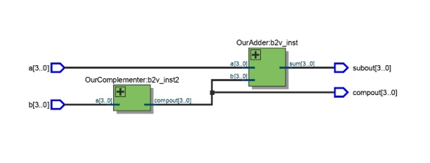
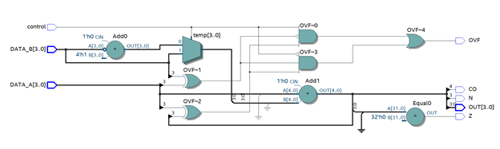
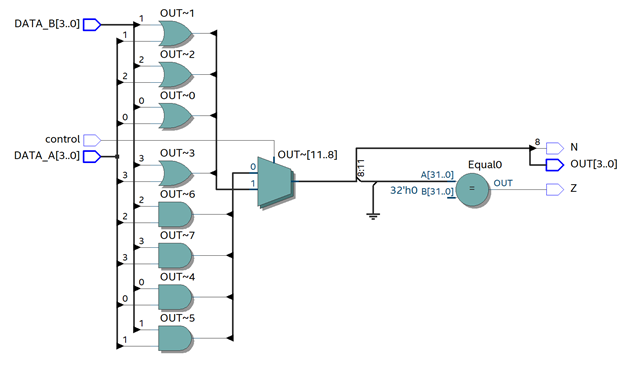
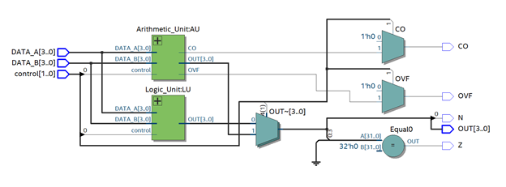
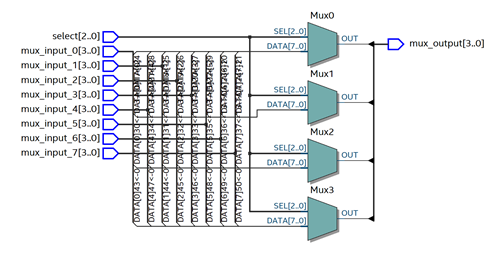
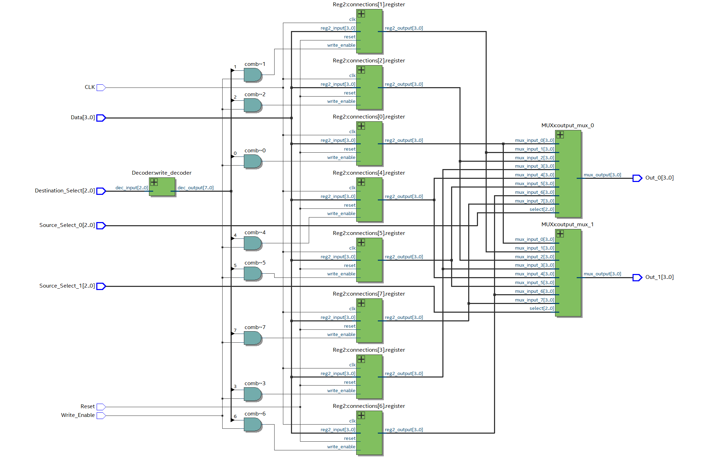
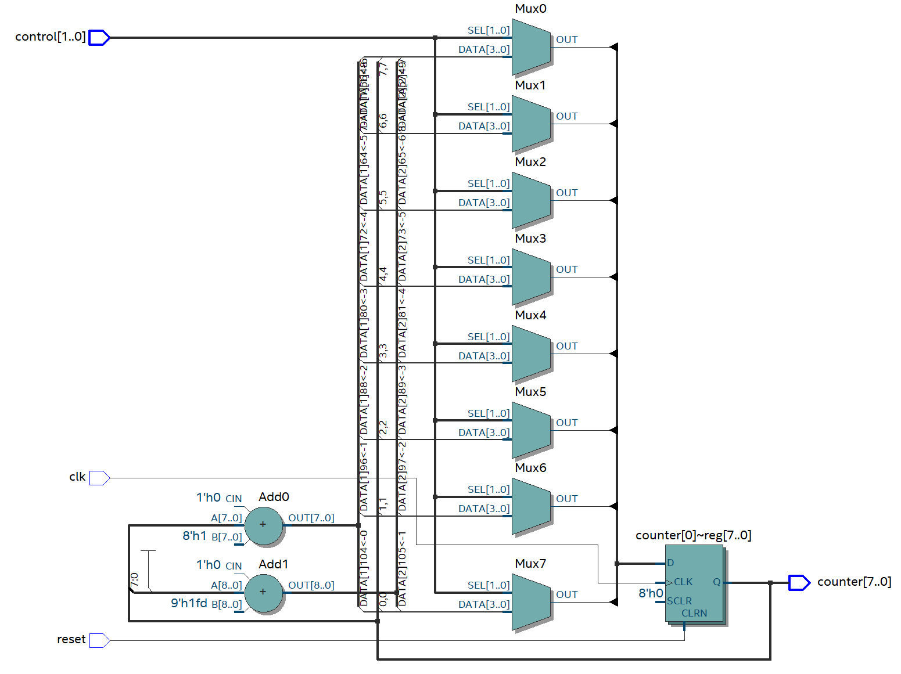
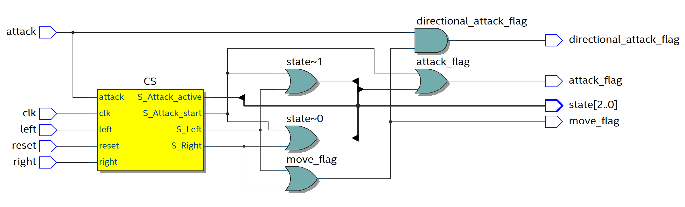

# EE314: Digital Circuits Laboratory

This repository contains the Verilog HDL implementations and Cocotb testbenches for the EE314 laboratory experiments. The course focuses on digital design using **FPGA (Field Programmable Gate Array)** boards, specifically the **DE1-SoC**.

---

## Experiment 0: Introduction to Verilog and Cocotb
The primary objective of this experiment was to familiarize ourselves with the hardware description environment and the automated testing framework.

* **Tools Introduced**: Learned to use **Quartus Prime Lite** for FPGA synthesis and **Cocotb** (a Python-based environment) for design verification.
* **Simple Adder**: Designed a 4-bit module to add two inputs using `assign` statements.
* **2's Complementer**: Implemented a module to calculate the 4-bit 2's complement of an input.
* **4-bit Subtractor**: Integrated the adder and complementer into a block diagram to perform the operation $a - b$.

  

* **FPGA Implementation**: Successfully uploaded the subtractor design to the DE1-SoC board, mapping inputs to switches and outputs to LEDs.

---

## Experiment 1: Creating an Arithmetic Logic Unit (ALU)
This experiment focused on building an **Arithmetic Logic Unit (ALU)**, a fundamental structure used in computer architectures.

* **Arithmetic Unit (AU)**: Developed a parameterized W-bit AU capable of 2's complement addition and subtraction. It outputs status flags: Carry Out (**CO**), Overflow (**OVF**), Negative (**N**), and Zero (**Z**).

  

* **Logic Unit (LU)**: Developed a W-bit LU for bitwise **AND** and **OR** operations, including Negative and Zero status flags.

  

* **ALU Integration**: Combined the AU and LU into a single top-level module. The final ALU uses a 2-bit control signal to select between the four operations.

  

---

## Experiment 2: Debugging Combinational Designs
This laboratory served as a tutorial on the concept of debugging digital hardware designs.

* **Synthesizer Errors/Warnings**: Practiced using Quartus's error reporting to fix syntax and configuration issues in a decoder module.
* **RTL Schematic Debugging**: Used the **RTL Viewer** to identify "naked eye" errors, such as unconnected pins or signals stuck at ground/high in an encoder design.
* **Functional Debugging**: Utilized Cocotb to find logic errors in a BCD converter by comparing its output against a Python-based model.
* **Combined Design Verification**: Integrated multiple modules (encoder, gray converter, and decoder) and learned why testing individual modules at every step is critical.

---

## Experiment 3: Sequential Design with Registers
We transitioned to sequential logic by designing a **Register File**.

* **Building Blocks**: Implemented essential components including an 8-to-1 Multiplexer (MUX) and a 3-to-8 Decoder.

  

* **Parameterized Registers**: Created two types of W-bit registers:
    * A simple register with **synchronous reset**.
    * A register with **synchronous reset and write enable**.
* **Register File**: Integrated the blocks to build a file of eight registers. It features synchronous writes on the rising clock edge and fully asynchronous (combinational) reads.

  

* **Specialized ALU**: Developed a 3-operation ALU for this system including Addition, Subtraction, and a **Move Not** ($-B$) operation.

---

## Experiment 4: Project Preparation & FSMs
The final preparatory experiment focused on **Finite State Machines (FSMs)** and timing components.

* **Sequential Modules**: Designed a W-bit counter (increment/decrement/hold) and a 16-bit **Linear Feedback Shift Register (LFSR)** for pseudo-random number generation.

  

* **Clock Divider**: Created a module to divide the FPGA's 50 MHz master clock to achieve slower, human-readable frequencies.
* **Game Logic FSM**: Implemented an FSM modeling a game character with states for `S_IDLE`, `S_Left`, `S_Right`, `S_Attack_start`, and `S_Attack_active`.

  

* **Hardware Demonstration**: Mapped FSM states to a 7-segment display (HEX0) and action flags to LEDs for physical verification on the DE1-SoC.